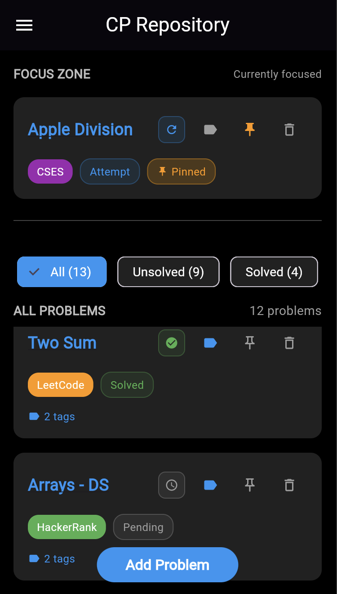

# CP Repository - Online Judge Problem Tracker

<em>**Home Screen**</em>

# Project Overview

This project is designed with a specific group of people in mind. Problem-solving in programming is highly valued, and one of the main ways to practice problem-solving is by solving problems on online judges. Problem solvers tackle problems from various judges, discover them from vibrant sources, and continuously exchange ideas to think in a more structured way than before.

Our job is very simple: to provide a space where all these problems can be kept in a central place. We believe that a focused and clean space, rather than random work, greatly boosts productivity.

---

## Existing Solutions

You might know that several similar initiatives already exist. For example, on [VJudge](https://vjudge.net/), problems from multiple platforms can be accessed together and solved in real-time via a single website. [CP31-Sheet](https://www.tle-eliminators.com/cp-sheet), on the other hand, organizes selected problems from Codeforces along with their solutions in a user-friendly and proactive environment. Websites like [youkn0wwho](https://youkn0wwho.academy/topic-list) keep topic-wise problems in a to-do-list style, prioritizing them highly and providing all the necessary materials. So, why did we decide to build this tracker?

---

## Our Vision

We dream. The current project output might reflect only 2–3% of that dream, but with user feedback and fresh-minded problem solvers, it can be matured. By skipping necessary features like authentication, login, and sign-up and focusing on the core task, we can say that we have brought all online judges into a single central app — where users can track, modify, and update their progress.

People often underestimate how important statistics can be in their lives. Every unsuccessful attempt is repeatedly presented to the user, pushed for solutions, and given rewarding feelings.

---

## Challenges & Limitations

Not all problems are added in VJudge, though what’s available is more than enough. In CP31-Sheet, no new problems can be added — it’s fixed. We want to remove these limitations and move forward.  

We know becoming perfect requires much more effort and exposure. There’s no heatmap, the progress bar is not ideal, UI needs modifications, system testing, design patterns, and most importantly, user feedback is lacking.

---

## Closing Thoughts

Despite all these limitations, we dream. We don’t know if we’ll succeed, but even if we can’t, we hope that any motivated young person, like a stick of dynamite, can climb the ladder to our current stage and complete 70–80% of the work — and that would make us happier than anything else could.

## Acknowledgment

To the LLMs. For their assistance and for excellently explaining code, database, and simulations.