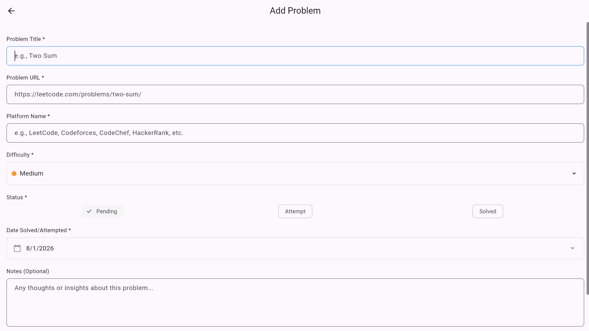
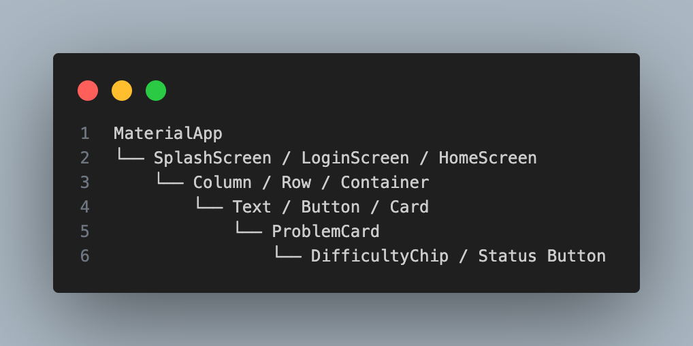

# CP Repository - Competitive Programming Problem Tracker

## The Problem We Solve

**Ever lost track of which problems you've solved across Codeforces, LeetCode, or HackerRank?**

We've been there too. That's why we built CP Repository - a simple place to keep all your CP problems organized.

### Key Features
- ✅ **Add problems from ANY platform** (LeetCode, Codeforces, AtCoder, etc.)
- ✅ **Mark them as Solved/In Progress** with status tracking
- ✅ **See your stats grow** with interactive visual analytics
- ✅ **Add notes for later review** for each problem
  

> *"A competitive programmer is someone who gets excited about things that no one else cares about."*
> 

---

## বিশেষ প্রতিবেদন

সেনাবাহিনীতে যোগ দিতে ফিটনেসই একমাত্র কথা নয়, দক্ষতার স্বাক্ষর রাখতে হয় মেধা দিয়ে। এ পর্বে আমরা সেই দু:সাহসিক অভিযান সম্পর্কে জানব, সেনা অফিসাররা কী পরিমাণ ত্যাগ স্বীকার করে আয়নাঘর গড়ে তুলেন, জানতে হবে না?

প্রথমে main.dart এর সাহায্যে গাড়ি (মেশিন) চালু করে কেন্দ্রে চলে আসেন, এন্ট্রি পয়েন্ট৷ সবার আগে সুন্দর হাতের লেখা(supabase চালু), তারপর মেইন টেস্ট(myApp)। 

সেনাবাহিনীতে ২ সেকেন্ডের নীরবতা থাকে সবার জন্য(app থেকে splashScreen, সেখানে time delay). নিয়মমাফিক কাগজপত্র(authentication) চেক করা হয়৷ ভাবতে ভাবতে ছাত্ররা হলের কাছাকাছি চলে এসেছে(login screen open).

যাদের ফর্ম পূরণ করা ছিল(registered user), সরাসরি হলে র তালা পেয়ে যাবে(home screen). যদিও সবাই তালা খুলতে পারবেনা, emailController ও passwordColtroller দুইজনে মিলে চেক করবে(ইনপুট নিবে)৷ সেগুলো আবার বিশেষ ছাকন পদ্ধতিতে চেক করবে, যে বাদ পড়বে, তাকে বলে দিবে কী কারণে বাদ পড়েছে। উত্তীর্ণ ছাত্রদের auth.signIn নামক আরেকটি হলে পাঠিয়ে দেয়া হয়। সমস্যা হোলো জাল ডকুমেন্ট দিয়ে অনেকে পরীক্ষা দিতে আসে, কারো আবার বাবার নামে ভুল, একে বলা হয় exception handling. দর্শক, এখন যাদের বত্রিশটা দাঁত বের করে হাসতে দেখছেন, সবাই পরবর্তী হলের (homeScreen)  এক্সেস পেয়ে গেছে, খুব খুশি।(User types email/password → AuthService.signIn() → 
Supabase checks credentials → If correct → Gets user session → Goes to Home)

যে চোরের দল ধরা খেয়ে(authentication না করতে পেরে) loginScreen এ গ্যালো, সে-তো পড়বে মহা ঝামেলায়। তাকে আবার AuthService.signUp() নামক ফর্ম ফিলাপ(register) করতে হবে। সব ঠিকঠাক থাকা মানে(successfully registered) প্রথম হলে ঢুকতে পারবে, তারপর পূর্বের সৈন্যদের মতোন পাশ করতে হবে।(User signs up → AuthService.signUp() → 
Supabase creates account → Goes to Login to sign in)

লোকে বলে সৈনিকদের জানের মায়া নেই, এর মানে এটাও যে ভীতুদের থেকে সাহসিদের আলাদা করতে হবে। এজন্য সর্বদা exit option(LogOut) থাকে, authService.signOut() দরজা খুলে এদের লাথ্যি মেরে বের করে দেয়া হয়৷ সেখান থেকে ইনট্রেন্স(Login Screen) দেখে কাঁদতে কাঁদতে এরা বাড়ি চলে যায়। শোনা কথা, ভীত সৈন্যরা নাকি দালালের মাধ্যমে আবার পরীক্ষা দিতে পারে(again Login). (_authService.signOut() → Back to LoginScreen)

পরাজিতদের কথা কেউ মনে রাখে না। আমরা বরং ছাত্রদের অভিনন্দন জানাই, আহলান-ওয়া-সাহলান, আপনারা শর্ট লিস্টেড হয়েছেন!!

দর্শক, আপনারা নিশ্চয় ভাবছেন উত্তীর্ণ ছাত্ররা কোথায়? সেনাবাহিনীর খুবই গোপন কক্ষে তারা অবস্থান করছেন। সূত্র বলছে, কক্ষটি(home screen) খুবই ছোট, কিন্তু অনেকগুলো একাধিক তলার বিছানা(scrollable). বিসমিল্লাতে যা চোখে পড়বে, একটা Pie Chart এ ঝড়ে পড়া ও পাশ করা সৈন্যদের রেশিও। সমগ্র কক্ষ জুড়ে মেধা যাচাই করার উপকরণ, তবে সবগুলোর মিল হোলো একইরকম বাক্সে রাখা(add problem screen is similar. And All Problem section shows the same format whatever we add)

সেনাবাহিনীতে কাজের লোক থাকে না, তাই বাক্স পরিষ্কারের দায়িত্ব সবার। ফাঁকা বাক্স দেখে অবাক হলেও শীঘ্রই বুঝতে পারলো লজিস্টিক্স আসে অন্য জায়গা থেকে(supabase), এগুলো প্রতিটা বাক্সে পুশ করতে হবে।  pieChartWidget নামক অফিসারটি রুক্ষ মেজাজের, একটু পরপর গুনে দেখছে কে কয়টা বাক্সে মালামাল ভর্তি করেছে। একজনকে কারো অফিসার বলে মনে হয় না, শাস্তির ভয়ে মুখে বলে না যদিও৷ problemCard নামক এই অফিসারের কাজই প্লেকার্ড হাতে বসে থাকা৷ বিরক্তিকর।(HomeScreen loads → ProblemService.getUserProblems() → 
Fetches YOUR problems from database → Shows in list + Pie Chart. 
 The screen consists of two main parts. The first is the Pie Chart, which calculates the number of problems that are Pending, Attempted, or Solved and displays the results as a visual donut chart with hover effects. The second is the Problem List, where each card includes interactive features: clicking the title opens the problem URL in a browser, clicking the status button cycles the problem through Pending → Attempt → Solved → Pending, and the delete button removes the problem from the database.)

বাহিনীতে ঢুকেই আয়নাঘরে পদ পাওয়া যায় না, কাজ করতে হয়। সৈনিকরা মনের আনন্দে কাজ করতে লাগলো। বাহিনীর সবচে লাক্সারিয়াস কক্ষের নাম হোলো add_problem_screen, সেখানে প্রতিনিয়ত সৃজনশীল কাজের প্রতি মনোনিবেশ করতে বিশেষ যত্ন নিতে হয়। রেকর্ড রাখা, ভুল হলে শুধরে দেয়া ইত্যাদি, প্রোগ্রেসের জন্য তো থাকেই।(user fills form -> clicks 'app problem' -> ProblemService.addProblem() -> Saves to Supabase -> Goes back to Home -> List refreshs automatically).

দর্শক, আপনাদের জ্ঞাতার্থে অবগত করছি যে, সৃজনশীলতারও লিমিট থাকে, আর ক্যান্টনমেন্টের মতোন জায়গায় খুবই কঠিনভাবে চেইন মেনটেইন করতে হয়। এই বিষয়টা মাথায় রেখে সবাইকে একই ধরণের ড্রেসকোড, খাবার, ট্রেনিং মেনটেইন করতে হয়(problem.dart is a BLUEPRINT/TEMPLATE for what a "Problem" looks like:. i.e id, title, url, platform, status, dates, noted ext).

পূর্বে অস্পষ্টভাবে বললেও, এবার স্পষ্ট ভাষায় বলতে চাই, সেনাবাহিনীর তথ্যগুলো ডরাতের হাতে চলে গেছে। সূত্র বলছে, problem_service.dart নামক প্রতীকি দল গোয়েন্দা সংস্থার মাধ্যমে কাজটি করে থাকে৷ মন চাইলেই যে কারো তথ্য সংগ্রহ, হালনাগাদ ও সংরক্ষণ করতে পারে৷ অনেকগুলো জরুরি পেপার মডিফাই করা হয়েছে, অগণিত সৈনিকের ব্যক্তিগত তথ্য জেনে যাচ্ছে শত্রুরা, এদিকে ইউসুফ সরকার চুপ, এটা কোনো কথা?(problem_service.dart is your bridge between flutter and database. You can perform the CURD operation here. For instance, addProblem, getUserProblems, updateProblemStatus, deleteProblem).

দু:খজনক হলেও সত্য যে, তোমার দেশ পত্রিকা এ ব্যাপারে কর্তৃপক্ষের দৃষ্টি আকর্ষণ করতে বারবার ব্যর্থ হচ্ছে। এদিকে ডারতীয় গোয়েন্দা সংস্থা(supebase_service.dart is the DIRECT PHONE LINE to your database) বসে নেই।

## App Flow Sequence

The journey begins in 'main.dart' where the application initializes, connects to Supabase with your project credentials, and launches the 'SplashScreen'. For two seconds, the splash screen uses 'AuthService.isLoggedIn()' to check if a user session exists from a previous login. If logged in, it proceeds directly to the 'HomeScreen'; otherwise, it navigates to the 'LoginScreen'.

At the 'LoginScreen', users enter their email and password into a form validated by 'Validators.validateEmail()' and 'Validators.validatePassword()'. Upon clicking 'See My Progress', the app calls 'AuthService.signIn()', which sends the credentials to Supabase Auth for verification. If successful, Supabase returns a user session and the app navigates to the 'HomeScreen'.

When 'HomeScreen' loads, its 'initState()' method immediately calls '_loadData()', which triggers 'ProblemService.getUserProblems()' to fetch all problems for the current user from the Supabase database. The raw JSON data is converted into 'Problem' objects using 'Problem.fromJson()', while 'ProblemService.getStats()' calculates counts for pending, attempted, and solved problems. The UI then displays an interactive pie chart, filter chips for status filtering, and a scrollable list of 'ProblemCard's.

Users add new problems by clicking the floating action button ('FAB'), which opens the 'AddProblemScreen'. Here they fill out a form with details like title (e.g., 'Two Sum'), URL (LeetCode link), platform ('LeetCode'), difficulty ('Easy'/'Medium'/'Hard'), status ('Pending'/'Attempt'/'Solved'), date solved, and optional notes. Clicking 'Add Problem' triggers form validation, and if all checks pass, a 'Problem' object is created from the form data.

The app then calls 'ProblemService.addProblem()' with the 'Problem' object, which converts it to JSON format using 'toJson()' and sends an 'INSERT' query to Supabase. Supabase's Row Level Security (RLS) verifies that 'auth.uid()' matches the 'user_id' before saving the data in the 'problems' table. Upon successful insertion, a snackbar confirms 'Problem added successfully!' and the user returns to 'HomeScreen', which automatically refreshes by calling '_loadData()' again, fetching the updated problem list and recalculating statistics.

On the home screen, each problem appears as an interactive 'ProblemCard'. Clicking the problem title uses 'UrlHelper.launchProblemUrl()' to open the URL in a browser. The status button cycles through 'Pending → Attempt → Solved' with each tap, calling 'ProblemService.updateProblemStatus()' to persist changes. The delete button shows a confirmation dialog, and if confirmed, calls 'ProblemService.deleteProblem()' to remove the problem from the database.

When users click the logout icon in the 'AppBar', 'AuthService.signOut()' clears the Supabase session and navigates back to 'LoginScreen', completing the full application cycle from authentication through data management to secure logout.

## Widget Hierarchy

